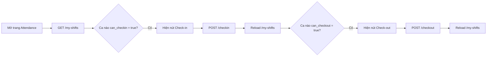

# Staff Attendance - Frontend Integration Guide

> Tài liệu dành cho team Frontend. Bao gồm API contracts, response examples, status mapping, và hướng dẫn UX/UI tích hợp vào web dashboard.

---

## Mục lục

1. [Tổng quan](#1-tổng-quan)
2. [Authentication & Test Accounts](#2-authentication--test-accounts)
3. [API Endpoints](#3-api-endpoints)
4. [Status Reference](#4-status-reference)
5. [Error Handling](#5-error-handling)
6. [Design System](#6-design-system)
7. [UX/UI Guidelines - Dashboard](#7-uxui-guidelines---dashboard)
8. [Responsive](#8-responsive)

---

## 1. Tổng quan

**Base URL:** `/api/attendance`

**Chức năng chính:**

- Xem danh sách ca hôm nay + trạng thái check-in/out
- Check-in / Check-out theo từng ca (multi-shift)
- Xem lịch sử chấm công (filter, pagination, summary)
- Xem chi tiết 1 bản ghi chấm công

**Luồng hoạt động:**



---

## 2. Authentication & Test Accounts

### 2.1. Header

Tất cả endpoints yêu cầu JWT token trong header:

```
Authorization: Bearer <token>
```

**Roles được phép:** `staff`, `admin`

Nếu không có token hoặc token không hợp lệ → `401`

### 2.2. Tài khoản test

> Các tài khoản staff đã được seed sẵn trong DB. Password mặc định: `123456`

| #   | Email                | Họ tên        | Password | Ghi chú            |
| --- | -------------------- | ------------- | -------- | ------------------ |
| 1   | `staff1@unilife.com` | Nguyễn Văn An | `123456` | Account test chính |
| 2   | `staff2@unilife.com` | Trần Thị Bình | `123456` |                    |
| 3   | `staff3@unilife.com` | Lê Minh Cường | `123456` |                    |
| 4   | `staff4@unilife.com` | Phạm Thu Dung | `123456` |                    |
| 5   | `staff5@unilife.com` | Hoàng Quốc Em | `123456` |                    |

**Login endpoint:** `POST /api/auth/login`

```json
{
  "email": "staff1@unilife.com",
  "password": "123456"
}
```

**Response:**

```json
{
  "success": true,
  "token": "eyJhbGci...",
  "data": {
    "user": {
      "_id": "6994a180...",
      "fullName": "Nguyễn Văn An",
      "email": "staff1@unilife.com",
      "role": "staff"
    }
  }
}
```

> Lưu token và gửi kèm trong header `Authorization: Bearer <token>` cho mọi request attendance.

---

## 3. API Endpoints

### 3.1. GET /attendance/my-shifts

> Lấy danh sách ca làm việc hôm nay (hoặc ngày chỉ định) cùng trạng thái chấm công.

**Query Parameters:**

| Param  | Type     | Required | Default | Description               |
| ------ | -------- | -------- | ------- | ------------------------- |
| `date` | `string` | No       | Hôm nay | Ngày cần xem (YYYY-MM-DD) |

**Request:**

```
GET /api/attendance/my-shifts
GET /api/attendance/my-shifts?date=2026-02-18
```

**Response 200:**

```json
{
  "success": true,
  "data": {
    "date": "2026-02-18",
    "shifts": [
      {
        "shift_id": "6994a1e016ca7ea5c7864801",
        "shift_name": "Ca sáng",
        "start_time": "06:00",
        "end_time": "10:00",
        "duration_minutes": 240,
        "canteen": {
          "id": "6990ab...",
          "name": "Canteen B - Khu B"
        },
        "assigned_by": {
          "id": "6990xx...",
          "fullName": "Nguyễn Quản Lý"
        },
        "can_checkin": true,
        "can_checkout": false,
        "attendance": null
      },
      {
        "shift_id": "6994a1e016ca7ea5c7864802",
        "shift_name": "Ca trưa",
        "start_time": "10:30",
        "end_time": "14:30",
        "duration_minutes": 240,
        "canteen": {
          "id": "6990ab...",
          "name": "Canteen B - Khu B"
        },
        "can_checkin": false,
        "can_checkout": true,
        "attendance": {
          "id": "6994b2...",
          "check_in_time": "2026-02-18T03:02:00.000Z",
          "check_out_time": null,
          "status": "on_time",
          "late_minutes": 2,
          "actual_work_minutes": 45,
          "formatted_working_time": "45m",
          "overtime_minutes": 0,
          "needs_review": false
        }
      }
    ]
  }
}
```

**FE Logic:**

| Trạng thái ca     | `can_checkin` | `can_checkout` | `attendance` | Hiển thị                         |
| ----------------- | ------------- | -------------- | ------------ | -------------------------------- |
| Chưa đến giờ      | `false`       | `false`        | `null`       | Badge "Sắp tới", nút disabled    |
| Sẵn sàng check-in | `true`        | `false`        | `null`       | Nút "Check-in" (primary)         |
| Đang làm việc     | `false`       | `true`         | `{...}`      | Nút "Check-out" + timer đếm giờ  |
| Đã hoàn thành     | `false`       | `false`        | `{...}`      | Badge trạng thái + thời gian làm |

---

### 3.2. POST /attendance/checkin

> Check-in vào 1 ca cụ thể.

**Request Body:**

```json
{
  "shift_id": "6994a1e016ca7ea5c7864801"
}
```

**Response 200:**

```json
{
  "success": true,
  "message": "Check-in thành công. Đúng giờ!",
  "warning": null,
  "data": {
    "id": "6994b2f0...",
    "shift_id": "6994a1e0...",
    "shift_name": "Ca sáng",
    "check_in_time": "2026-02-18T05:58:00.000Z",
    "status": "on_time",
    "late_minutes": 0,
    "message": "Check-in thành công. Đúng giờ!",
    "warning": null
  }
}
```

**Có warning khi quên check-out ca trước:**

```json
{
  "success": true,
  "message": "Check-in thành công. Đúng giờ!",
  "warning": "Bạn quên check-out ca: Ca sáng. Vui lòng liên hệ quản lý.",
  "data": { ... }
}
```

**Errors:**

| Status | Tình huống            | Message                                                       |
| ------ | --------------------- | ------------------------------------------------------------- |
| `400`  | Thiếu shift_id        | `"shift_id is required"`                                      |
| `400`  | shift_id không hợp lệ | `"Shift ID không hợp lệ"`                                     |
| `400`  | Không có ca hôm nay   | `"Bạn không có ca làm việc này hôm nay"`                      |
| `400`  | Đã check-in rồi       | `"Bạn đã check-in ca này lúc 06:02 rồi"`                      |
| `400`  | Quá sớm               | `"Quá sớm để check-in. Có thể check-in từ 05:45"`             |
| `409`  | Race condition        | `"Check-in thất bại — ca này đã được xử lý bởi request khác"` |

---

### 3.3. POST /attendance/checkout

> Check-out khỏi 1 ca cụ thể. Nếu về sớm, gửi kèm lý do.

**Request Body:**

```json
{
  "shift_id": "6994a1e016ca7ea5c7864801",
  "early_leave_reason": "Bệnh đột xuất"
}
```

> `early_leave_reason` chỉ cần gửi khi nhân viên rời sớm (FE có thể hiện popup hỏi lý do nếu `now < shift_end - 5min`).

**Response 200:**

```json
{
  "success": true,
  "message": "Check-out thành công. Tổng: 3h 52m",
  "data": {
    "id": "6994b2f0...",
    "shift_id": "6994a1e0...",
    "shift_name": "Ca sáng",
    "check_in_time": "2026-02-18T05:58:00.000Z",
    "check_out_time": "2026-02-18T09:50:00.000Z",
    "status": "on_time",
    "actual_work_minutes": 232,
    "overtime_minutes": 0,
    "overtime_approved": false,
    "early_leave_reason": null,
    "message": "Check-out thành công. Tổng: 3h 52m"
  }
}
```

**Errors:**

| Status | Tình huống     | Message                                                        |
| ------ | -------------- | -------------------------------------------------------------- |
| `400`  | Thiếu shift_id | `"shift_id is required"`                                       |
| `400`  | Chưa check-in  | `"Bạn phải check-in trước khi check-out"`                      |
| `400`  | Đã check-out   | `"Bạn đã check-out lúc 10:02 rồi"`                             |
| `409`  | Race condition | `"Check-out thất bại — ca này đã được xử lý bởi request khác"` |

---

### 3.4. GET /attendance/history

> Lịch sử chấm công với filters, pagination, và summary tổng hợp.

**Query Parameters:**

| Param        | Type     | Required | Default        | Description                           |
| ------------ | -------- | -------- | -------------- | ------------------------------------- |
| `month`      | `string` | No       | Tháng hiện tại | Format: `YYYY-MM` (VD: `2026-02`)     |
| `year`       | `number` | No       | -              | Lọc theo năm (VD: `2026`)             |
| `date`       | `string` | No       | -              | Lọc 1 ngày (YYYY-MM-DD)               |
| `start_date` | `string` | No       | -              | Từ ngày (YYYY-MM-DD)                  |
| `end_date`   | `string` | No       | -              | Đến ngày (YYYY-MM-DD)                 |
| `shift_id`   | `string` | No       | -              | Lọc theo ca                           |
| `status`     | `string` | No       | -              | Lọc theo trạng thái (xem bảng Status) |
| `page`       | `number` | No       | `1`            | Trang hiện tại                        |
| `limit`      | `number` | No       | `20`           | Số record/trang (tối đa 100)          |

> **Lưu ý:** Nếu không gửi filter nào, mặc định trả về tháng hiện tại.

**Request:**

```
GET /api/attendance/history
GET /api/attendance/history?month=2026-02&status=late&page=1&limit=20
GET /api/attendance/history?start_date=2026-02-01&end_date=2026-02-28
```

**Response 200:**

```json
{
  "success": true,
  "data": {
    "summary": {
      "total_shifts": 45,
      "on_time": 38,
      "late": 5,
      "early_leave": 1,
      "missing_checkout": 1,
      "total_work_minutes": 10800,
      "total_hours": 180,
      "overtime_hours": 3,
      "total_late_minutes": 87
    },
    "records": [
      {
        "id": "6994b2f0...",
        "date": "2026-02-18T00:00:00.000Z",
        "shift": {
          "id": "6994a1e0...",
          "name": "Ca sáng",
          "start_time": "06:00",
          "end_time": "10:00"
        },
        "canteen": {
          "id": "6990ab...",
          "name": "Canteen B - Khu B"
        },
        "check_in_time": "2026-02-18T05:58:00.000Z",
        "check_out_time": "2026-02-18T10:02:00.000Z",
        "status": "on_time",
        "late_minutes": 0,
        "actual_work_minutes": 242,
        "formatted_work_time": "4h 2m",
        "overtime_minutes": 2,
        "needs_review": false
      }
    ],
    "pagination": {
      "current_page": 1,
      "total_pages": 3,
      "total_records": 45,
      "limit": 20
    }
  }
}
```

---

### 3.5. GET /attendance/:id

> Chi tiết 1 bản ghi chấm công. Bao gồm IP/device, thông tin review, overtime.

**Request:**

```
GET /api/attendance/6994b2f0832b2c0398047042
```

**Response 200:**

```json
{
  "success": true,
  "data": {
    "id": "6994b2f0...",
    "date": "2026-02-18T00:00:00.000Z",
    "shift": {
      "id": "6994a1e0...",
      "name": "Ca sáng",
      "start_time": "06:00",
      "end_time": "10:00",
      "duration_minutes": 240
    },
    "canteen": {
      "id": "6990ab...",
      "name": "Canteen B - Khu B"
    },
    "assigned_by": {
      "id": "6990xx...",
      "fullName": "Nguyễn Quản Lý"
    },
    "check_in_time": "2026-02-18T05:58:00.000Z",
    "check_in_ip": "192.168.1.100",
    "check_in_device": "Mozilla/5.0 (Windows NT 10.0; Win64; x64)...",
    "check_out_time": "2026-02-18T10:02:00.000Z",
    "check_out_ip": "192.168.1.100",
    "check_out_device": "Mozilla/5.0 (Windows NT 10.0; Win64; x64)...",
    "status": "on_time",
    "late_minutes": 0,
    "actual_work_minutes": 242,
    "formatted_work_time": "4h 2m",
    "overtime_minutes": 2,
    "overtime_approved": false,
    "early_leave_reason": null,
    "needs_review": false,
    "reviewed_by": null,
    "reviewed_at": null,
    "manager_note": null,
    "notes": null,
    "created_at": "2026-02-18T05:58:00.000Z",
    "updated_at": "2026-02-18T10:02:00.000Z"
  }
}
```

**Errors:**

| Status | Tình huống      | Message                              |
| ------ | --------------- | ------------------------------------ |
| `400`  | ID không hợp lệ | `"Attendance ID không hợp lệ"`       |
| `404`  | Không tìm thấy  | `"Không tìm thấy bản ghi chấm công"` |

---

## 4. Status Reference

### 4.1. Attendance Status (`status`)

| Value              | Nghĩa          | Màu gợi ý          | Badge text       |
| ------------------ | -------------- | ------------------ | ---------------- |
| `on_time`          | Đúng giờ       | `#22C55E` (green)  | Đúng giờ         |
| `late`             | Trễ 16-60 phút | `#F59E0B` (amber)  | Trễ              |
| `critical_late`    | Trễ > 60 phút  | `#EF4444` (red)    | Trễ nghiêm trọng |
| `early_leave`      | Về sớm         | `#F97316` (orange) | Về sớm           |
| `overtime`         | Làm thêm giờ   | `#8B5CF6` (purple) | Overtime         |
| `missing_checkout` | Quên check-out | `#6B7280` (gray)   | Thiếu check-out  |

### 4.2. Assignment Status (internal, dùng cho `can_checkin` / `can_checkout`)

| Value         | Nghĩa                       |
| ------------- | --------------------------- |
| `assigned`    | Đã phân ca, chưa check-in   |
| `checked_in`  | Đã check-in, chưa check-out |
| `checked_out` | Đã check-out (hoàn thành)   |
| `absent`      | Vắng mặt                    |

---

## 5. Error Handling

### Format lỗi chung:

```json
{
  "success": false,
  "error": "ERROR_CODE",
  "message": "Mô tả lỗi bằng tiếng Việt"
}
```

### HTTP Status Codes:

| Code  | Ý nghĩa                   | FE xử lý                               |
| ----- | ------------------------- | -------------------------------------- |
| `200` | Thành công                | Hiển thị data                          |
| `400` | Lỗi input                 | Hiện toast warning với `message`       |
| `401` | Chưa đăng nhập            | Redirect về login                      |
| `404` | Không tìm thấy            | Hiện empty state                       |
| `409` | Xung đột (race condition) | Hiện toast "Vui lòng thử lại" + reload |
| `500` | Lỗi server                | Hiện toast error chung                 |

---

## 6. Design System

### 6.1. Color Palette

**Status Colors:**

| Status             | Background | Text      | Border    | CSS Variable      |
| ------------------ | ---------- | --------- | --------- | ----------------- |
| `on_time`          | `#ECFDF5`  | `#065F46` | `#6EE7B7` | `--color-success` |
| `late`             | `#FFFBEB`  | `#92400E` | `#FCD34D` | `--color-warning` |
| `critical_late`    | `#FEF2F2`  | `#991B1B` | `#FCA5A5` | `--color-danger`  |
| `early_leave`      | `#FFF7ED`  | `#9A3412` | `#FDBA74` | `--color-orange`  |
| `overtime`         | `#F5F3FF`  | `#5B21B6` | `#C4B5FD` | `--color-purple`  |
| `missing_checkout` | `#F9FAFB`  | `#374151` | `#D1D5DB` | `--color-gray`    |

**Semantic Colors:**

| Role           | Light mode | Dark mode | Usage                 |
| -------------- | ---------- | --------- | --------------------- |
| Primary        | `#2563EB`  | `#3B82F6` | Nút Check-in, links   |
| Danger         | `#DC2626`  | `#EF4444` | Nút Check-out         |
| Surface        | `#FFFFFF`  | `#1F2937` | Card background       |
| Border         | `#E5E7EB`  | `#374151` | Card border, dividers |
| Text Primary   | `#111827`  | `#F9FAFB` | Headings, labels      |
| Text Secondary | `#6B7280`  | `#9CA3AF` | Sub-text, timestamps  |

### 6.2. Typography

| Element                 | Font         | Size | Weight | Line-height |
| ----------------------- | ------------ | ---- | ------ | ----------- |
| Page title              | Inter/System | 24px | 700    | 32px        |
| Card title (shift name) | Inter/System | 16px | 600    | 24px        |
| Body text               | Inter/System | 14px | 400    | 20px        |
| Badge text              | Inter/System | 12px | 500    | 16px        |
| Caption (timestamps)    | Inter/System | 12px | 400    | 16px        |
| Stat number (summary)   | Inter/System | 28px | 700    | 36px        |
| Stat label              | Inter/System | 12px | 500    | 16px        |

### 6.3. Spacing

| Token         | Value | Usage              |
| ------------- | ----- | ------------------ |
| `--space-xs`  | 4px   | Icon-text gap      |
| `--space-sm`  | 8px   | Trong badge, chip  |
| `--space-md`  | 12px  | Card padding inner |
| `--space-lg`  | 16px  | Card padding       |
| `--space-xl`  | 24px  | Section gap        |
| `--space-2xl` | 32px  | Page padding       |

### 6.4. Components

**Status Badge:**

```css
.badge {
  display: inline-flex;
  align-items: center;
  gap: 6px;
  padding: 4px 10px;
  border-radius: 9999px;
  font-size: 12px;
  font-weight: 500;
}
.badge::before {
  content: "";
  width: 6px;
  height: 6px;
  border-radius: 50%;
  background: currentColor;
}
```

**Card (shift card):**

```css
.shift-card {
  background: var(--color-surface);
  border: 1px solid var(--color-border);
  border-radius: 12px;
  padding: 16px;
  transition:
    box-shadow 0.2s,
    border-color 0.2s;
}
.shift-card:hover {
  box-shadow: 0 4px 12px rgba(0, 0, 0, 0.08);
  border-color: var(--color-primary);
}
```

**Primary Button (Check-in):**

```css
.btn-checkin {
  background: #2563eb;
  color: white;
  padding: 10px 24px;
  border-radius: 8px;
  font-weight: 600;
  font-size: 14px;
  transition:
    background 0.15s,
    transform 0.1s;
}
.btn-checkin:hover {
  background: #1d4ed8;
}
.btn-checkin:active {
  transform: scale(0.97);
}
.btn-checkin:disabled {
  background: #93c5fd;
  cursor: not-allowed;
}
```

**Danger Button (Check-out):**

```css
.btn-checkout {
  background: #dc2626;
  color: white;
  padding: 10px 24px;
  border-radius: 8px;
  font-weight: 600;
  font-size: 14px;
}
.btn-checkout:hover {
  background: #b91c1c;
}
```

### 6.5. Toast Notifications

| Type                         | Background               | Icon          | Duration          |
| ---------------------------- | ------------------------ | ------------- | ----------------- |
| Success (check-in OK)        | `#065F46` trên `#ECFDF5` | CheckCircle   | 3s (auto-dismiss) |
| Warning (trễ, quên checkout) | `#92400E` trên `#FFFBEB` | AlertTriangle | 5s                |
| Error (lỗi input)            | `#991B1B` trên `#FEF2F2` | XCircle       | 5s                |
| Info (409 conflict)          | `#1E40AF` trên `#EFF6FF` | Info          | 4s + auto reload  |

### 6.6. Animations

```css
/* Card appear */
@keyframes fadeInUp {
  from {
    opacity: 0;
    transform: translateY(8px);
  }
  to {
    opacity: 1;
    transform: translateY(0);
  }
}
.shift-card {
  animation: fadeInUp 0.3s ease-out;
}

/* Timer pulse khi đang check-in */
@keyframes pulse {
  0%,
  100% {
    opacity: 1;
  }
  50% {
    opacity: 0.6;
  }
}
.timer-active {
  animation: pulse 2s infinite;
}

/* Status badge enter */
@keyframes scaleIn {
  from {
    transform: scale(0.8);
    opacity: 0;
  }
  to {
    transform: scale(1);
    opacity: 1;
  }
}
.badge-enter {
  animation: scaleIn 0.2s ease-out;
}
```

---

## 7. UX/UI Guidelines - Dashboard

### 7.1. Trang chính: Ca hôm nay

**Vị trí:** Component nằm trong content area chính của dashboard, bên phải sidebar.

**Layout Desktop (>= 1024px):**

```
┌─── Sidebar ───┬─────────────────── Content Area ────────────────────────┐
│               │                                                         │
│  Dashboard    │  Chấm công hôm nay              Thứ 3, 18/02/2026      │
│  Chấm công ← │  ─────────────────────────────────────────────────────── │
│  Lịch sử     │                                                         │
│  ...         │  ┌─────────────────┐  ┌─────────────────┐               │
│               │  │ Ca sáng         │  │ Ca trưa         │               │
│               │  │ 06:00 - 10:00  │  │ 10:30 - 14:30   │               │
│               │  │ Canteen B       │  │ Canteen B       │               │
│               │  │                 │  │                 │               │
│               │  │ ● Đúng giờ     │  │ Đang làm 1h25m  │               │
│               │  │ In 05:58       │  │ In 10:32        │               │
│               │  │ Out 10:02      │  │                 │               │
│               │  │ Tổng: 4h 02m   │  │ [  Check-out  ] │               │
│               │  └─────────────────┘  └─────────────────┘               │
│               │                                                         │
│               │  ┌─────────────────┐                                    │
│               │  │ Ca chiều        │                                    │
│               │  │ 15:00 - 19:00   │                                    │
│               │  │ Canteen B       │                                    │
│               │  │                 │                                    │
│               │  │ Sắp tới        │                                    │
│               │  │ Check-in từ    │                                    │
│               │  │ 14:45          │                                    │
│               │  │ [Check-in] off │                                    │
│               │  └─────────────────┘                                    │
│               │                                                         │
└───────────────┴─────────────────────────────────────────────────────────┘
```

**Cards grid:** `display: grid; grid-template-columns: repeat(auto-fill, minmax(300px, 1fr)); gap: 16px;`

**Card states:**

| State             | Card style                  | Left border       | Nút                          |
| ----------------- | --------------------------- | ----------------- | ---------------------------- |
| Sắp tới           | `opacity: 0.7`              | `#D1D5DB` (gray)  | Check-in disabled            |
| Sẵn sàng check-in | Bình thường                 | `#2563EB` (blue)  | Check-in primary (pulse nhẹ) |
| Đang làm          | `border: 2px solid #22C55E` | `#22C55E` (green) | Check-out danger + timer     |
| Hoàn thành        | Bình thường                 | màu theo status   | Badge + tổng giờ             |

**Timer realtime:** Khi `can_checkout === true`, FE tính `now - check_in_time` mỗi giây.

```javascript
// Timer logic
const [elapsed, setElapsed] = useState(0);
useEffect(() => {
  if (!canCheckout || !checkInTime) return;
  const timer = setInterval(() => {
    const diff = Math.floor((Date.now() - new Date(checkInTime)) / 1000);
    setElapsed(diff);
  }, 1000);
  return () => clearInterval(timer);
}, [canCheckout, checkInTime]);

const formatElapsed = (sec) => {
  const h = Math.floor(sec / 3600);
  const m = Math.floor((sec % 3600) / 60);
  const s = sec % 60;
  return `${h}h ${String(m).padStart(2, "0")}m ${String(s).padStart(2, "0")}s`;
};
```

---

### 7.2. Check-in / Check-out Flow

**Check-in:**

1. User nhấn nút "Check-in" → nút hiện loading spinner
2. Gọi `POST /checkin` với `{ shift_id }`
3. `200`: Toast success, reload shifts
4. Nếu `warning` trong response: Hiện alert bar vàng phía trên cards
5. `400`/`409`: Toast warning, nút hết loading

**Check-out sớm (trước shift end - 5 phút):**

FE tự detect bằng cách so sánh `Date.now()` với `parseShiftEndTime(shift.end_time)` của ca đang check-out.

Nếu về sớm → hiện **Modal:**

- Title: "Xác nhận check-out sớm"
- Body: "Bạn đang ra về trước giờ kết thúc ca. Vui lòng nhập lý do:"
- Input: textarea, max 500 ký tự, placeholder "Nhập lý do..."
- Footer: [Hủy] [Xác nhận check-out]
- Gửi: `{ shift_id, early_leave_reason }`

Nếu check-out đúng giờ → gọi API trực tiếp, không cần modal.

---

### 7.3. Tab Lịch sử chấm công

**Layout Desktop:**

```
┌──────────────────────────────────────────────────────────────────────────┐
│  Lịch sử chấm công                                                      │
├──────────────────────────────────────────────────────────────────────────┤
│                                                                          │
│  [◀]  Tháng 2, 2026  [▶]                                                │
│                                                                          │
│  ┌────────────┐ ┌────────────┐ ┌────────────┐ ┌────────────┐            │
│  │  Tổng ca   │ │  Đúng giờ  │ │    Trễ     │ │  Tổng giờ  │            │
│  │    45      │ │     38     │ │     5      │ │   180h     │            │
│  │  ☰ total   │ │  ✓ green   │ │  ⏰ amber  │ │  ⌛ purple  │            │
│  └────────────┘ └────────────┘ └────────────┘ └────────────┘            │
│                                                                          │
│  Status: [ Tất cả     ▾ ]    Ca: [ Tất cả ca  ▾ ]                       │
│                                                                          │
│  ┌───────┬───────────┬──────────┬───────────┬────────┬────────────┐      │
│  │ Ngày  │ Ca        │ Check-in │ Check-out │ Giờ    │ Trạng thái │      │
│  ├───────┼───────────┼──────────┼───────────┼────────┼────────────┤      │
│  │ 18/02 │ Ca sáng   │ 05:58    │ 10:02     │ 4h 02m │ ● Đúng giờ │      │
│  │ 18/02 │ Ca trưa   │ 10:38    │ 14:30     │ 3h 52m │ ● Trễ 8p   │      │
│  │ 17/02 │ Ca sáng   │ 06:00    │ 10:00     │ 4h 00m │ ● Đúng giờ │      │
│  │ 17/02 │ Ca chiều  │ 15:05    │ 17:30     │ 2h 30m │ ● Về sớm   │      │
│  │ 16/02 │ Ca sáng   │ —        │ —         │ —      │ ○ Vắng     │      │
│  └───────┴───────────┴──────────┴───────────┴────────┴────────────┘      │
│                                                                          │
│  Hiển thị 1-20 / 45     [◀] [ 1 ] [ 2 ] [ 3 ] [▶]                      │
│                                                                          │
└──────────────────────────────────────────────────────────────────────────┘
```

**Summary stats cards:** `display: grid; grid-template-columns: repeat(4, 1fr); gap: 16px;`

**Mapping summary → Stats cards:**

| Field          | Label    | Icon         | Color  |
| -------------- | -------- | ------------ | ------ |
| `total_shifts` | Tổng ca  | CalendarDays | Blue   |
| `on_time`      | Đúng giờ | CheckCircle  | Green  |
| `late`         | Trễ      | Clock        | Amber  |
| `total_hours`  | Tổng giờ | Timer        | Purple |

**Filter dropdown → API param:**

| Filter label     | API param                 |
| ---------------- | ------------------------- |
| Tất cả           | (không gửi `status`)      |
| Đúng giờ         | `status=on_time`          |
| Trễ              | `status=late`             |
| Trễ nghiêm trọng | `status=critical_late`    |
| Về sớm           | `status=early_leave`      |
| Overtime         | `status=overtime`         |
| Thiếu check-out  | `status=missing_checkout` |

**Click row:** Mở detail panel bên phải (hoặc modal) → gọi `GET /attendance/:id`

---

### 7.4. Detail Panel

Khi click vào 1 row → hiện **slide-in panel** từ bên phải (width: 400px):

```
                                    ┌──────────────────────────┐
                                    │  ✕  Chi tiết chấm công   │
                                    │                          │
                                    │  18/02/2026              │
                                    │  Ca sáng (06:00-10:00)   │
                                    │  Canteen B - Khu B       │
                                    │  Người phân: Nguyễn Q.Lý │
                                    │                          │
                                    │  ● Đúng giờ              │
                                    │                          │
                                    │  ── Check-in ──────────  │
                                    │  05:58                   │
                                    │  IP: 192.168.1.100       │
                                    │  Device: Chrome/Win      │
                                    │                          │
                                    │  ── Check-out ─────────  │
                                    │  10:02                   │
                                    │  IP: 192.168.1.100       │
                                    │  Device: Chrome/Win      │
                                    │                          │
                                    │  ── Tổng kết ──────────  │
                                    │  Thời gian: 4h 02m       │
                                    │  Trễ: 0 phút             │
                                    │  Overtime: 2p (Chờ duyệt)│
                                    │                          │
                                    └──────────────────────────┘
```

**Conditional rendering:**

| Field               | Khi nào hiện                  |
| ------------------- | ----------------------------- |
| Check-out section   | `check_out_time !== null`     |
| IP/Device           | Luôn hiện                     |
| Overtime row        | `overtime_minutes > 0`        |
| Early leave reason  | `early_leave_reason !== null` |
| Review section      | `reviewed_by !== null`        |
| Badge "Cần xem xét" | `needs_review === true`       |

---

### 7.5. Empty States

| Tình huống              | Message                                                | Icon gợi ý  |
| ----------------------- | ------------------------------------------------------ | ----------- |
| Không có ca hôm nay     | "Bạn không có ca làm việc hôm nay"                     | CalendarOff |
| Lịch sử trống           | "Chưa có dữ liệu chấm công trong khoảng thời gian này" | FileSearch  |
| Filter không có kết quả | "Không tìm thấy bản ghi phù hợp. Thử thay đổi bộ lọc." | Filter      |

---

### 7.6. Polling / Auto-refresh

| Trang                  | Tần suất      | Lý do                              |
| ---------------------- | ------------- | ---------------------------------- |
| Ca hôm nay (my-shifts) | Mỗi 60 giây   | Cập nhật `can_checkin` khi đến giờ |
| Timer đếm giờ          | Mỗi 1 giây    | Realtime working time              |
| Lịch sử                | Không polling | Data tĩnh, load khi filter/paging  |

```javascript
useEffect(() => {
  fetchMyShifts();
  const interval = setInterval(fetchMyShifts, 60000);
  return () => clearInterval(interval);
}, []);
```

---

### 7.7. Timezone

- Server trả `Date` dạng ISO 8601 UTC: `"2026-02-18T05:58:00.000Z"`
- FE convert sang UTC+7 khi hiển thị

```javascript
const formatTime = (iso) =>
  new Date(iso).toLocaleTimeString("vi-VN", {
    hour: "2-digit",
    minute: "2-digit",
    hour12: false,
  });

const formatDate = (iso) =>
  new Date(iso).toLocaleDateString("vi-VN", {
    day: "2-digit",
    month: "2-digit",
    year: "numeric",
  });
```

---

## 8. Responsive

### Breakpoints:

| Breakpoint | Width       | Layout                                                  |
| ---------- | ----------- | ------------------------------------------------------- |
| Desktop    | >= 1280px   | Sidebar + content, cards grid 3 cols, table full        |
| Laptop     | 1024-1279px | Sidebar collapsed + content, cards grid 2 cols          |
| Tablet     | 768-1023px  | No sidebar (hamburger), cards grid 2 cols, table scroll |
| Mobile     | < 768px     | Full width, cards stack 1 col, table → card list        |

### Shift Cards:

```css
.shifts-grid {
  display: grid;
  gap: 16px;
}

/* Desktop: 3 columns */
@media (min-width: 1280px) {
  .shifts-grid {
    grid-template-columns: repeat(3, 1fr);
  }
}

/* Laptop/Tablet: 2 columns */
@media (min-width: 768px) and (max-width: 1279px) {
  .shifts-grid {
    grid-template-columns: repeat(2, 1fr);
  }
}

/* Mobile: 1 column */
@media (max-width: 767px) {
  .shifts-grid {
    grid-template-columns: 1fr;
  }
}
```

### Summary Stats:

```css
.stats-grid {
  display: grid;
  gap: 12px;
}

@media (min-width: 1024px) {
  .stats-grid {
    grid-template-columns: repeat(4, 1fr);
  }
}
@media (min-width: 640px) and (max-width: 1023px) {
  .stats-grid {
    grid-template-columns: repeat(2, 1fr);
  }
}
@media (max-width: 639px) {
  .stats-grid {
    grid-template-columns: repeat(2, 1fr);
  }
  .stat-card {
    padding: 12px;
  }
  .stat-number {
    font-size: 22px;
  }
}
```

### Table → Card list (Mobile):

Dưới 768px, bảng lịch sử chuyển thành danh sách card:

```
┌─────────────────────────────────┐
│  18/02/2026 - Ca sáng           │
│  06:00 - 10:00                  │
│                                 │
│  In: 05:58    Out: 10:02        │
│  Tổng: 4h 02m   ● Đúng giờ     │
└─────────────────────────────────┘

┌─────────────────────────────────┐
│  18/02/2026 - Ca trưa           │
│  10:30 - 14:30                  │
│                                 │
│  In: 10:38    Out: 14:30        │
│  Tổng: 3h 52m   ● Trễ 8p       │
└─────────────────────────────────┘
```

### Detail Panel:

| Viewport            | Behavior                             |
| ------------------- | ------------------------------------ |
| Desktop (>= 1024px) | Slide-in panel bên phải, width 400px |
| Tablet (768-1023px) | Slide-in panel, width 360px          |
| Mobile (< 768px)    | Full-screen modal (bottom sheet)     |
